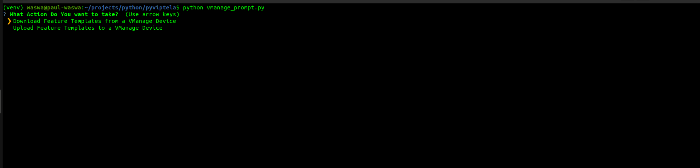
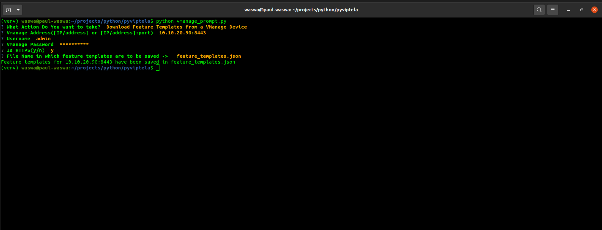
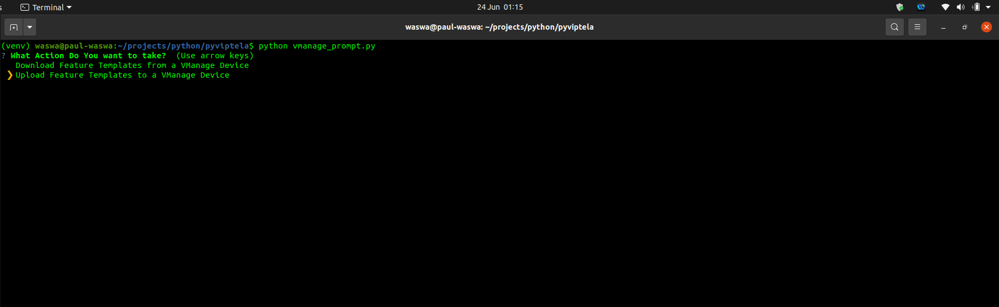
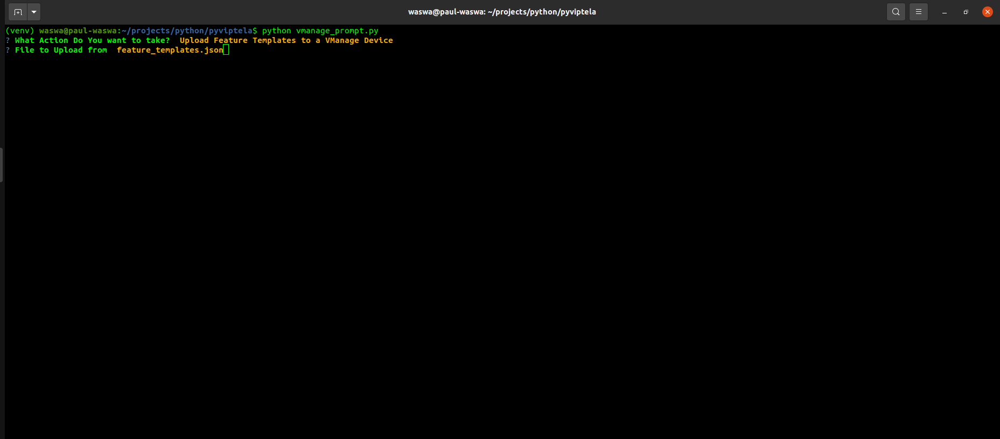
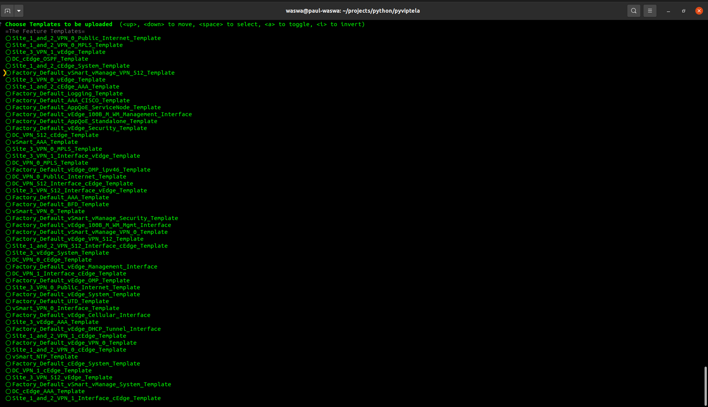

# What is PyViptela
Pyviptela is consisted of various python packages, all carrying out requests to the viptela controller and currently only downloading and uploading templates to Vmanage. 

## PyViptela Documentation

### Setting up the project
```shell
# Clone the repository locally
git clone https://github.com/Paul-weqe/pyviptela
cd pyviptela

# Create the Python Virtual Environment
python3 -m venv venv
source venv/bin/activate

pip install -r requirements.txt

# And we have the environment up and ready to go
```

## Transferring all Templates from one vmanage device to another
The transfer of templates from one vmanage to another is a two step process:
1. Download the templates from the originating vmanage device
2. Upload the templates to the receiving vmanage device

### 1. Download templates from originating vmanage device. 
First, we run the following command:
```shell
python vmanage_prompt.py
```

This will provide a prompt that looks like the following:


Select the first option (<b>Download All Templates</b>)
After this you will be prompted to enter the credentials of the vmanage device you want to Download from. Enter the values of the respective fields depending on what your vmanage device. 

After this, you will be asked for the name you want to save the configuration as. We can save it as whatever name we want to remember the configuration as. 
It will take sometime but once completed you will have downloaded all the templates from the vmanage that you specified. 

### 2. Upload the templates to the receiving vmanage device. 
You enter the `python vmanage_prompt.py` command just like before. This time, however, you choose <b>Upload All Templates to a Vmanage Device</b>. 

You will have the following prompt:


### Download Feature Templates to a json file
To download feature templates, we first run the following command:
```shell
python vmanage_prompt.py
```

This will provide us with the following interface:

At this point, we will select the `Download Feature Template from a VManage Device`

Which will then lead us to this:


At this point, we enter all the required fields:
- Address (which will either be only the address or address:port combination for the Vmanage)
- username 
- password

It will then ask you if the vmanage device is using http or https. you either click y/n. If anything else is clicked, the program will take that as a no.

The final step will be the name for which to save your file. In this case, we will save our file as `feature_templates.json`. 

### Upload Feature Templates from a json file

Once we have download the json file from the vmanage,  we can upload it to any other vmanage device. 
Or many other vmanage devices that we will need it to be uploaded to.

So let's do this. First, just like before, we run:
```shell
python vmanage_prompt.py
```

Just like before, it will feed you the following screen:


Only that this time, we will choose `Upload templates to a VManage Device`



Now, we will have to choose the file to upload from, the specific templates we want to upload then the vmanage device we want to upload to. And there we have it, our template

